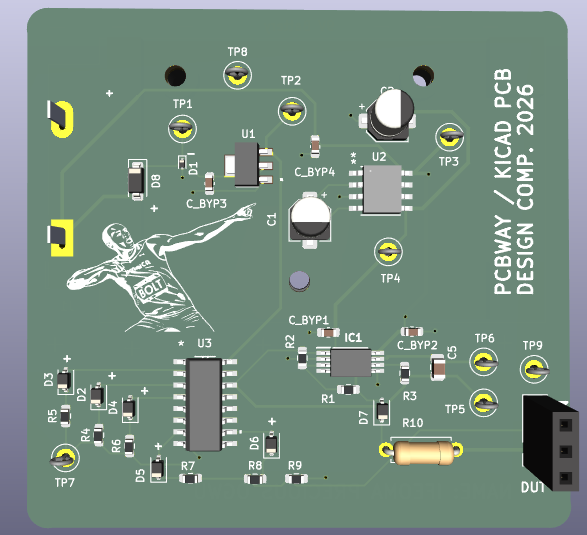
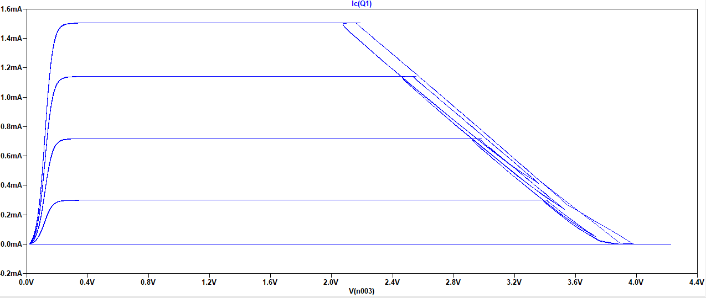
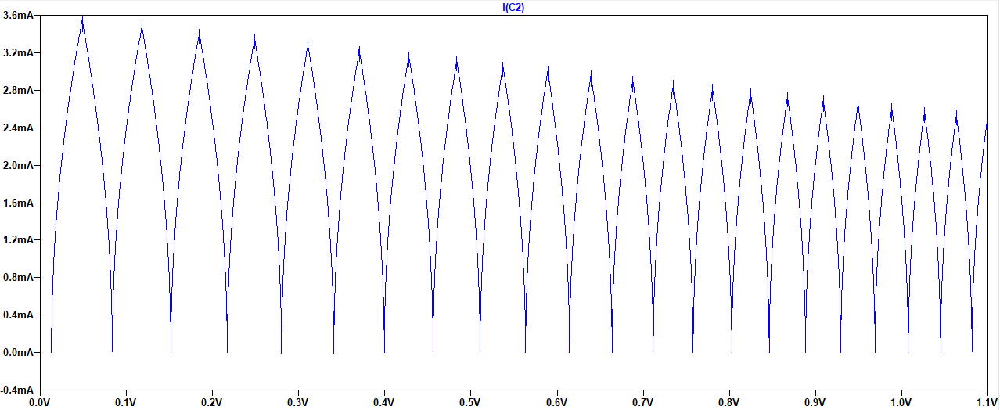
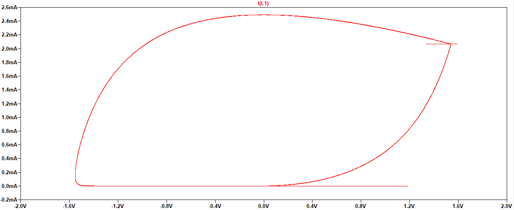

# Analogue I-V Curve Tracer Module

An fully analogue evaluation module designed to generate characteristic I-V (current-voltage) curves for Devices Under Test (DUT) [resistors, capacitors, inductors, diodes, NPN, NMOS] using standard oscilloscope X-Y plotting. 

## 🚀 Overview
Unlike digital curve tracers, this design uses zero microcontrollers. It utilizes a synchronized hardware-only topology:
* **Base/Gate Drive:** A CD4017B decade counter configured for a 5-step staircase waveform.
* **Collector/Drain Sweep:** An op-amp integrator generating a continuous triangle wave (approx. 9V pk-pk).
* **Power Management:** 9V battery-powered with an integrated charge pump (ICL7660) for negative rail generation and ESD/Reverse Polarity protection.

---

## ✨ Key Features
- **Standalone Operation:** No firmware to flash; purely analog circuitry.
- **Precision Layout:** 4-layer PCB ($SIG \rightarrow GND \rightarrow GND \rightarrow SIG$) optimized for low-noise microamp-level current steps.
- **Multi-Component Support:** Optimized for NPN Transistors, NMOS, Diodes (including schottky, zener etc), Inductors, Capacitors, Resistors.
- **Reactive Analysis:** Capable of visualizing phase-shift loops in Capacitors and Inductors.

---

## 🛠 Hardware Specifications
| Parameter | Typical Value |
| :--- | :--- |
| **Supply Voltage** | 9V (Alkaline Battery) |
| **Sweep Frequency** | ~100 Hz |
| **Base Current Steps** | 5 Steps (approx. 10µA increments) |
| **PCB Dimensions** | 60mm x 60mm |
| **Layer Count** | 4 Layers |

---

## 📈 Sample Traces
| NPN Transistor | Capacitor (100μF) | Inductor (1H) |
| :---: | :---: | :---: |
|  |  |  |

---

## 🔌 Setup & Usage
To visualize curves on your oscilloscope:
1. **Power:** Connect a 9V battery to the onboard holder.
2. **Probing:** - Connect one probe (this will be X-axis) to the part of your DUT that is connected to pin 1.
   - Connect a clamp probe (this will be Y-axis)  around the wire or pin that connects your Device Under Test (DUT) to pin 1
3. **Scope Settings:** - Enable **X-Y Mode**.
   - Use XY mode to plot current vs. voltage
   - Ensure both ground clips are tied to the circuit ground.

---

## 📂 Repository Structure
* `/kicad_project`: Full project files, including schematic, layout and fabrication files.
* `/resources`: PDFs I used for learning more on curve tracers.
* `/bom`: Bill of Materials in Excel format.

---

## ⚠️ Design Limitations
- **Polarity:** This version is optimized for NPN and NMOS devices. PNP/PMOS devices will result in mirrored/inverted plots.
- **Power Dissipation:** Limited by the sourcing capability of the TL072H op-amps and the 1k$\Omega$ sense resistor.

---

## 🥚 Easter Egg
Look closely at the silkscreen: the module features **Usain Bolt**. Why? 

## 📜 References & Acknowledgments
Detailed resources used during the design phase (MIT reports, Op-amp integrator theory, etc.) are archived in the `/resources` folder.

